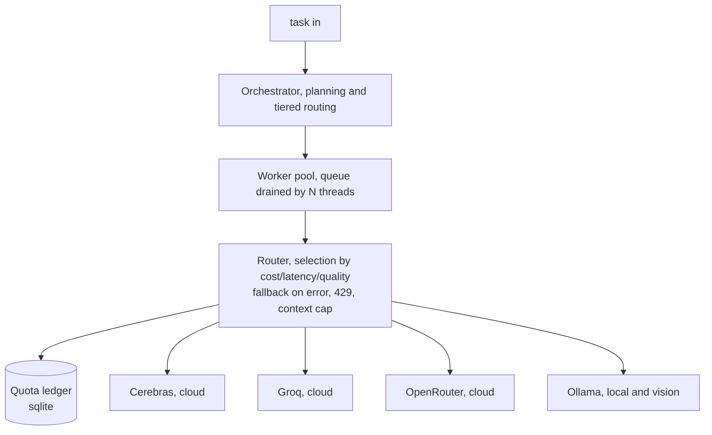

# LLMaestro

**Orchestration of multi-LLM AI agents, cloud and local.**

LLMaestro is a software orchestration layer that routes each task to the most
suitable LLM provider (cloud API or on-device model) according to **cost,
latency, and quality**, with **automatic fallback** on failure or rate-limit,
**tool-use** execution, **MCP** connectors, and **local inference**. A single
high-quality orchestrator stays in charge; self-contained sub-tasks are
dispatched to whichever provider can do them cheapest and fastest.

> **Status: work in progress.** The routing core is implemented and tested:
> provider selection, retries, fallback, cooldowns, quota accounting and the
> worker pool. Agent loops, RAG and the OpenAI-compatible endpoint are next.
>

---

## Why

Running a *full* agent against free/low-cost APIs does not scale: a complete
agent sends **32–42k tokens per request** (base system prompt + tool schemas
are largely incompressible), which immediately hits per-minute token limits or
shared-pool rate-limits on free tiers. The same providers answer a **direct,
single-purpose call** with a short prompt in **~0.15s**, comfortably under those
limits.

LLMaestro is built on that finding:

- Keep a **capable orchestrator** in charge of planning and hard reasoning.
- **Offload leaf tasks** (reformat, translate, classify, summarize) as
  *targeted direct calls* to the cheapest provider that can do the job.
- **Fall back automatically** when a provider errors, rate-limits, or caps the
  context: try the next one in the chain instead of failing.

This keeps quality where it matters while staying within free/low-cost budgets.

---

## Architecture



Cross-cutting: tool-use connectors, MCP servers, output evaluation.

The orchestrator decides *what* needs to happen; the router decides *where* it
runs. Cloud providers are reached over their HTTP APIs behind a unified
interface; local models run on-device via Ollama for sovereign, offline
inference. Connectors and MCP servers give agents the ability to take real
actions (search, browse, read external data).

---

## Components

| Layer | What it does | Status |
|---|---|---|
| **Router** | selects a provider by cost/latency/quality/reliability, retries what is worth retrying, falls back on the rest, and puts failing providers on cooldown | implemented |
| **Quota ledger** | tracks requests and tokens per minute and per day for each provider, and tightens its own limits when a provider answers 429 | implemented |
| **Worker pool** | a queue drained by N threads sharing one router, so cooldowns and quota learned by one worker apply at once to the others | implemented |
| **Cloud providers** | Cerebras, Groq, OpenRouter behind a unified interface | implemented |
| **Local inference** | Ollama (open-weights, on-device, sovereign), including vision models | implemented |
| **Tool-use connectors** | self-contained tools an agent can call (e.g. Reddit search) | implemented, first connector: see [`connectors/`](connectors/) |
| **MCP integrations** | Model Context Protocol servers (browser automation, external data) | documented: see [`docs/MCP-INTEGRATIONS.md`](docs/MCP-INTEGRATIONS.md) |
| **Output evaluation** | scoring / QA pass on model outputs | planned |
| **Vision / computer-use** | agent "sees" the screen and acts on it | planned |

---

## Repository layout

```
llmaestro/       the package: router, quota ledger, worker pool, provider clients
  providers/     one client per wire protocol (OpenAI-compatible, Ollama)
tests/           offline test suite, no key and no network required
connectors/      tool-use connectors (self-contained, callable by the orchestrator)
docs/            architecture deep-dives and integration notes
providers.toml   provider catalogue: models, capabilities, ranks, known quotas
.env.example     the keys to fill in, copy to .env
pyproject.toml   packaging, no runtime dependencies
README.md        this file
LICENSE          MIT
```

---

## Install

No dependencies to install. Python 3.11 or newer is the only requirement.

```bash
git clone https://github.com/sofianealhoz/LLMaestro.git
cd LLMaestro
cp .env.example .env    # then fill in at least one key
python3 -m llmaestro --check
```

Installing the package (`pip install -e .`) only adds the `llmaestro` command as a
shortcut for `python3 -m llmaestro`.

---

## Configuration

Two files, and no secret in the repository.

**`.env`** holds the keys and is gitignored. Any provider whose key is missing is
skipped silently, so a single configured provider is enough to run. An exported
environment variable always wins over the file.

**`providers.toml`** is the catalogue: for each provider its base URL, model,
context window, capabilities (`vision`, `tools`), the cost, latency and quality
ranks the router sorts on, and its known free-tier quotas. Changing the fallback
order means editing this file, not the code.

Declared quotas are a starting point. When a provider refuses with 429, the
ledger records the usage observed at that moment as the real ceiling, so a wrong
value in the catalogue corrects itself after one refusal. State lives in
`~/.llmaestro/state.db`.

`python3 -m llmaestro --check` reports what is configured, what is missing, what
is unreachable and how much quota is left:

```
catalogue: providers.toml
  groq             ready        llama-3.1-8b-instant    ctx 131072  cost 2 latency 1 quality 3
      rpm: 4/30
  ollama           unreachable  qwen2.5-coder:7b        ctx 32768   cost 1 latency 4 quality 4
  cerebras         skipped      CEREBRAS_API_KEY is not set
```

---

## Usage

From the command line:

```bash
# one call, cheapest provider that can do it
python3 -m llmaestro "summarise in one sentence: ..."

# many calls at once through the worker pool
python3 -m llmaestro --batch prompts.txt --workers 4

# rank providers differently
python3 -m llmaestro --policy latency "classify as bug or feature: ..."

# an image, routed to a vision-capable provider
python3 -m llmaestro --image screenshot.png "what does this say?"

# the whole path with a local fake provider: no key, no network
python3 -m llmaestro --dry-run "hello"
```

From Python:

```python
from llmaestro import Router, Task, WorkerPool, build_all, load_catalogue, load_env

load_env()
specs, skipped = load_catalogue()
router = Router(build_all(specs))

print(router.complete(Task.from_prompt("translate to French: hello")).text)

# hundreds of leaf tasks, four at a time, sharing one router
tasks = [Task.from_prompt(f"classify: {item}") for item in items]
for result in WorkerPool(router, workers=4).run(tasks):
    print(result.text if result.ok else result.error)
```

When every provider is exhausted the router raises `AllProvidersFailed`, whose
`attempts` list says what was tried, what was skipped and why.

---

## Tests

```bash
python3 -m unittest discover -s tests
```

The suite needs no key and no network: providers are scripted fakes, the clock is
injected, and the ledger runs in memory.

---

## Providers

| Provider | Type | Role in the chain |
|---|---|---|
| Cerebras | cloud (free tier) | primary for leaf tasks: fast, generous daily quota (context-capped) |
| Groq | cloud (free tier) | high-volume fallback, very fast small models |
| OpenRouter | cloud (free tier) | secondary fallback, multi-model, single key |
| Ollama | local | sovereign / offline inference (planned) |

Credentials are read from the local environment and never committed.

---

## Roadmap

- [x] Router with cost-tiered provider selection + fallback (Cerebras → Groq → OpenRouter)
- [x] Quota ledger with limits learned from refusals
- [x] Worker pool for concurrent leaf tasks
- [x] Local inference backend (Ollama, e.g. Qwen2.5-Coder)
- [ ] OpenAI-compatible endpoint, so any existing client can route through LLMaestro
- [ ] Output evaluation pass
- [ ] Vision / computer-use support

---

## Stack

- **Python, standard library only**: orchestrator, router, quota ledger and
  provider clients. No runtime dependency, so the package runs on any Python
  3.11 or newer with nothing installed (`urllib` for HTTP, `tomllib` for
  configuration, `sqlite3` for the ledger, `threading` for the pool).
- **Node.js**: existing standalone connectors (e.g. Reddit search).
- **MCP** (Model Context Protocol) for rich tool integrations; **TOML** for
  configuration.

## License

MIT, see [LICENSE](LICENSE).
