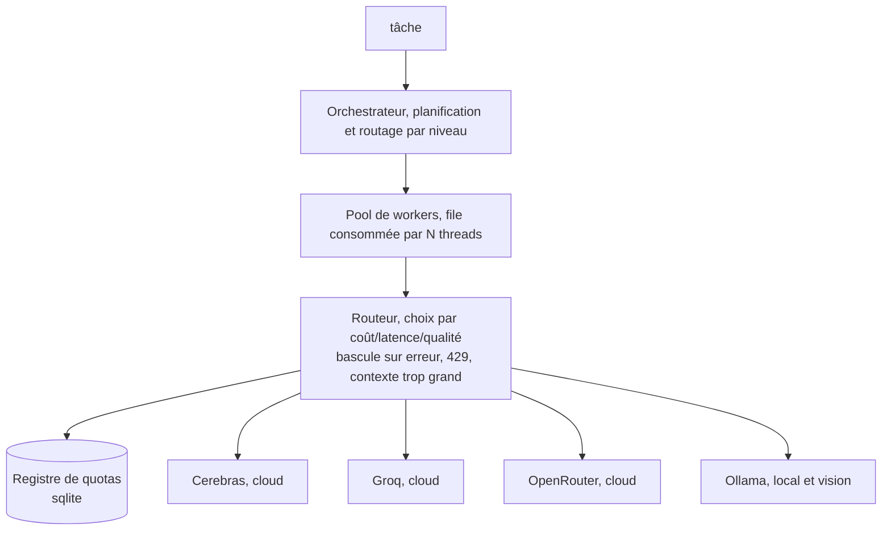

# LLMaestro

**Orchestration d'agents IA multi-LLM, cloud et local.**

Couche d'orchestration qui envoie chaque tâche au fournisseur le plus adapté, API cloud ou
modèle local, selon coût, latence et qualité. Bascule automatique sur panne ou quota atteint,
exécution d'outils, connecteurs MCP, inférence locale. Un orchestrateur capable garde le
raisonnement, les sous-tâches autonomes partent chez le moins cher.

> **En cours.** Noyau de routage implémenté et testé : sélection, réessais, bascule, mises au
> repos, comptage des quotas, pool de workers, appels d'outils. Veille opérationnelle. Restent
> les agents confinés, le point d'entrée compatible OpenAI et le RAG.

---

## Pourquoi

Un agent complet ne tient pas sur des API gratuites. Il envoie 32 à 42k tokens par requête,
prompt système et schémas d'outils compris, largement incompressibles. Résultat : plafond de
tokens par minute atteint immédiatement. Les mêmes fournisseurs répondent en 0,15 s à un appel
direct et court.

D'où le principe :

- garder un orchestrateur capable sur la planification et le raisonnement dur ;
- déporter les tâches feuilles, reformater, traduire, classer, résumer, en appels directs chez
  le moins cher qui sache les faire ;
- basculer automatiquement sur erreur, refus pour quota ou contexte trop grand, au lieu
  d'échouer.

Qualité là où elle compte, budget gratuit ailleurs.

---

## Architecture



L'orchestrateur décide quoi faire, le routeur décide où. Providers cloud derrière une interface
unique, modèles locaux via Ollama. Connecteurs et serveurs MCP pour les actions réelles.

---

## Composants

| Couche | Rôle | État |
|---|---|---|
| **Routeur** | choix par coût, latence, qualité ou fiabilité, réessai de ce qui vaut la peine, bascule sur le reste, mise au repos des fournisseurs qui cassent | fait |
| **Registre de quotas** | requêtes et tokens par minute et par jour, lus dans les en-têtes `x-ratelimit-*` du fournisseur, resserrés après un refus | fait |
| **Pool de workers** | file consommée par N threads partageant un seul routeur, donc mises au repos et quotas visibles de tous | fait |
| **Providers cloud** | Cerebras, Groq, OpenRouter derrière une interface unique | fait |
| **Inférence locale** | Ollama, poids ouverts, hors ligne, modèles de vision compris | fait |
| **Appels d'outils** | schémas envoyés, appels relus, résultats renvoyés au modèle | fait |
| **Veille** | collecte dépôts, posts et versions, note chaque item via le pool, écrit un digest classé | fait, voir [`docs/WATCH.md`](docs/WATCH.md) |
| **Connecteurs** | outils autonomes appelables, recherche Reddit sans clé | fait, voir [`connectors/`](connectors/) |
| **Intégrations MCP** | serveurs Model Context Protocol | documenté, voir [`docs/MCP-INTEGRATIONS.md`](docs/MCP-INTEGRATIONS.md) |
| **Agents confinés** | boucle bornée dans un worktree jetable, outils sans verbe destructeur, promotion sur ordre | fait, voir [`docs/AGENTS.md`](docs/AGENTS.md) |
| **Évaluation des sorties** | passe de notation et de contrôle | prévu |

---

## Arborescence

```
llmaestro/       le paquet : routeur, registre de quotas, pool, clients providers
  providers/     un client par protocole, compatible OpenAI et Ollama
  watch/         la veille : collecteurs, dédoublonnage, notation, digest
  agent/         les agents confinés : bac à sable, outils, boucle, journal
tests/           suite hors ligne, ni clé ni réseau
connectors/      connecteurs autonomes appelables par l'orchestrateur
docs/            notes d'architecture et d'intégration
providers.toml   catalogue : modèles, capacités, rangs, quotas connus
.env.example     les clés à remplir, à copier en .env
watch.example.toml  sources et axes de notation, à copier en watch.toml
agent.example.toml  commandes autorisées et budgets, à copier en agent.toml
pyproject.toml   empaquetage, aucune dépendance
```

---

## Installation

Rien à installer. Python 3.11 ou plus récent suffit.

```bash
git clone https://github.com/sofianealhoz/LLMaestro.git
cd LLMaestro
cp .env.example .env    # puis remplir au moins une clé
python3 -m llmaestro --check
```

`pip install -e .` ajoute seulement la commande `llmaestro` comme raccourci.

---

## Configuration

Deux fichiers, aucun secret dans le dépôt.

`.env` porte les clés, ignoré par git. Un provider sans sa clé est écarté en silence, un seul
suffit à faire tourner la chaîne. Une variable exportée l'emporte sur le fichier.

`providers.toml` est le catalogue : URL, modèle, fenêtre de contexte, capacités `vision` et
`tools`, rangs de coût, latence et qualité, quotas connus. Changer l'ordre de bascule se fait
ici, pas dans le code.

Les quotas déclarés ne sont qu'un point de départ. Les fournisseurs annoncent leurs vraies
limites dans leurs en-têtes, le registre les relit à chaque appel réussi. État dans
`~/.llmaestro/state.db`.

`python3 -m llmaestro --check` dit ce qui est configuré, ce qui manque, ce qui est injoignable,
quel modèle n'existe pas et combien de quota reste :

```
catalogue: providers.toml
  cerebras         ready        gpt-oss-120b            ctx 8192    cost 2 latency 1 quality 3
      rpm: 1/5
      tpm: 108/30000
  ollama           unreachable  qwen2.5-coder:7b        ctx 32768   cost 1 latency 4 quality 4
  openrouter       skipped      OPENROUTER_API_KEY is not set
```

---

## Usage

En ligne de commande :

```bash
# un appel, chez le moins cher qui sache le faire
python3 -m llmaestro "résume en une phrase : ..."

# beaucoup d'appels d'un coup, par le pool
python3 -m llmaestro --batch prompts.txt --workers 4

# classer les fournisseurs autrement
python3 -m llmaestro --policy latency "classe en bug ou évolution : ..."

# une image, routée vers un modèle de vision
python3 -m llmaestro --image capture.png "que dit cette capture ?"

# tout le chemin avec un faux provider local, ni clé ni réseau
python3 -m llmaestro --dry-run "bonjour"

# la veille : collecte, notation, digest classé
python3 -m llmaestro watch --limit 40
```

Confier une tâche à un agent, qui travaille dans une copie jetable du dépôt :

```bash
python3 -m llmaestro run --repo ~/projets/mon-depot "écris les tests unitaires de panier.py"
python3 -m llmaestro runs              # les runs et leur état
python3 -m llmaestro inspect <run-id>  # le diff, ou --journal pour les étapes
python3 -m llmaestro promote <run-id>  # applique sur le vrai dépôt, sur ordre
```

Tant que `promote` n'est pas lancé, le dépôt cible n'a pas bougé d'un octet.

Depuis Python :

```python
from llmaestro import Router, Task, WorkerPool, build_all, load_catalogue, load_env

load_env()
specs, ecartes = load_catalogue()
router = Router(build_all(specs))

print(router.complete(Task.from_prompt("traduis en anglais : bonjour")).text)

# des centaines de tâches feuilles, quatre à la fois, un seul routeur
taches = [Task.from_prompt(f"classe : {item}") for item in items]
for resultat in WorkerPool(router, workers=4).run(taches):
    print(resultat.text if resultat.ok else resultat.error)
```

Quand tous les fournisseurs sont épuisés, le routeur lève `AllProvidersFailed`. Sa liste
`attempts` dit ce qui a été tenté, ce qui a été écarté et pourquoi.

---

## Tests

```bash
python3 -m unittest discover -s tests
```

Ni clé ni réseau : providers scriptés, horloge injectée, registre en mémoire.

---

## Fournisseurs

| Fournisseur | Type | Rôle dans la chaîne |
|---|---|---|
| Cerebras | cloud, gratuit | tâches feuilles, très rapide, contexte plafonné à 8K |
| Groq | cloud, gratuit | volume, petits modèles très rapides, plus un 70B pour la qualité |
| Gemini | cloud, gratuit | 1 million de contexte et vision, le seul à encaisser un gros fichier |
| Mistral | cloud, gratuit | Codestral, spécialisé code, 256K de contexte |
| GitHub Models | cloud, gratuit | 45 modèles sur un compte GitHub, quotas serrés |
| OpenRouter | cloud, gratuit | second recours, multi-modèles, une seule clé |
| Ollama | local | souverain, hors ligne, vision |

Tous parlent le format OpenAI, donc ajouter un fournisseur ne demande aucun code, seulement
une entrée dans `providers.toml`.

Les identifiants sont lus dans l'environnement, jamais commités.

---

## Feuille de route

- [x] Routeur avec sélection par coût et bascule, Cerebras puis Groq puis OpenRouter
- [x] Registre de quotas lu dans les en-têtes des fournisseurs
- [x] Pool de workers pour les tâches feuilles concurrentes
- [x] Inférence locale, Ollama
- [x] Appels d'outils
- [x] Veille technique
- [x] Agents confinés dans un worktree jetable
- [ ] Point d'entrée compatible OpenAI, pour brancher n'importe quel client existant
- [ ] Évaluation des sorties
- [ ] Vision et pilotage d'écran

---

## Pile

- **Python, bibliothèque standard seule** : orchestrateur, routeur, registre, clients. Aucune
  dépendance, donc rien à installer. `urllib` pour HTTP, `tomllib` pour la configuration,
  `sqlite3` pour le registre, `threading` pour le pool.
- **Node.js** : connecteurs autonomes existants, recherche Reddit.
- **MCP** pour les intégrations riches, **TOML** pour la configuration.

Le code, les commentaires et l'historique de commits sont en anglais.

## Licence

MIT, voir [LICENSE](LICENSE).
